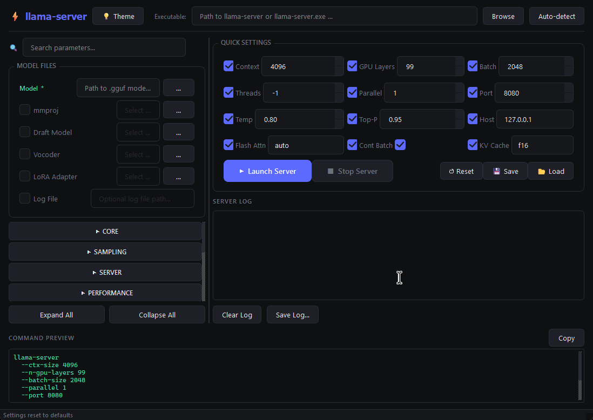
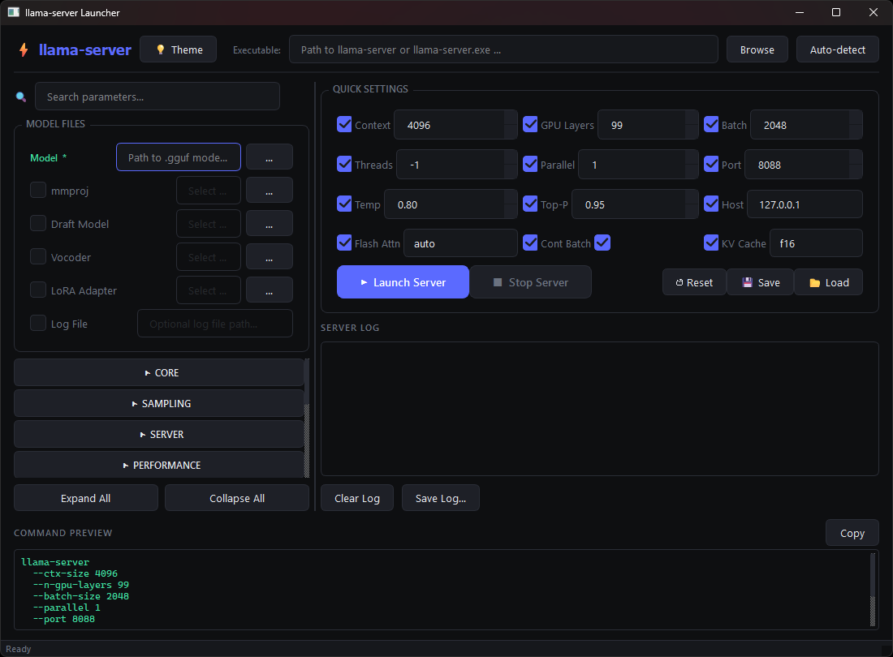
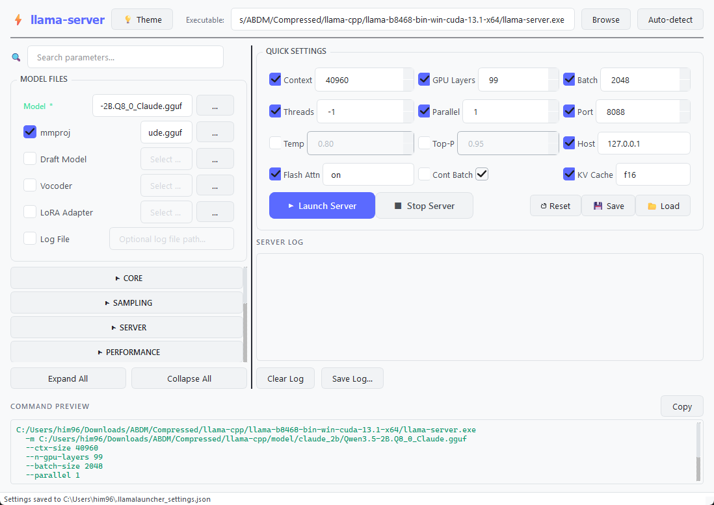
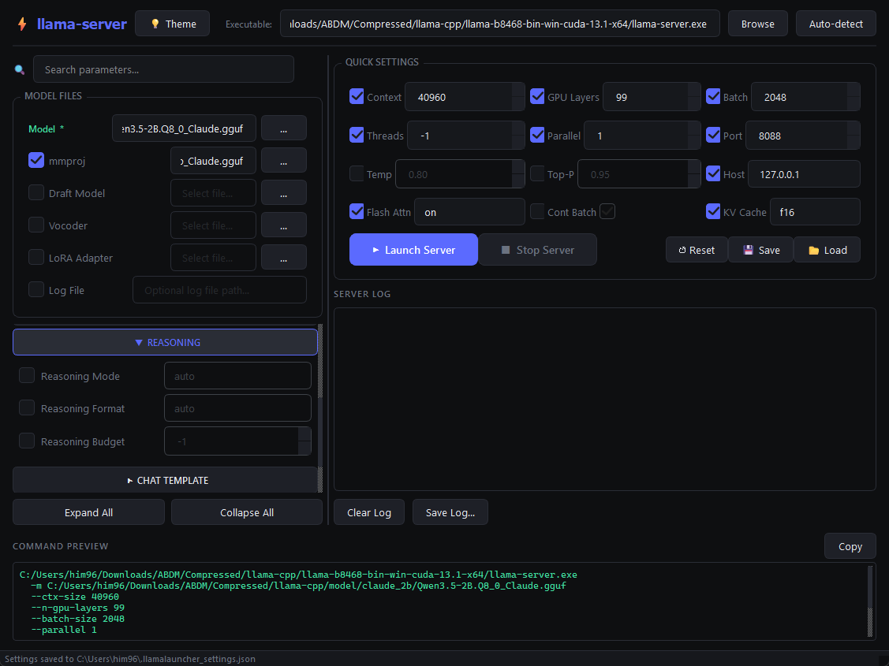
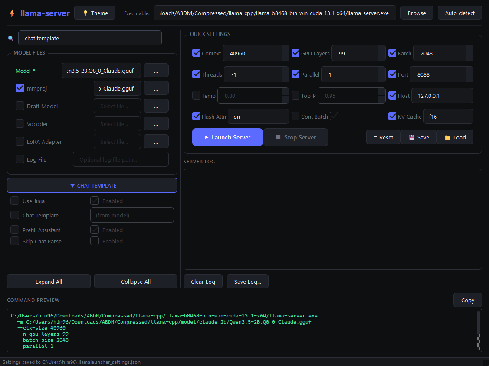

# ⚡ llama-server Launcher

<div align="center">

[](https://www.python.org/downloads/)
[](https://www.riverbankcomputing.com/software/pyqt/)
[](LICENSE)
[](https://github.com/ggerganov/llama.cpp)

**A modern, feature-rich GUI launcher for llama-server**

[Features](#-features) · [Installation](#-installation) · [Usage](#-usage) · [Screenshots](#-screenshots) · [Demo](#-demo-video) · [Parameters](#-parameters) · [FAQ](#-faq)

---


<div align="center">
   
## 🎥 Demo Video
<!-- Add your video below -->

*( Demonstrating GUI Usage )*

<br>

</div>

## 🖼️ Screenshots

<div align="center">

## Dark Mode
<!-- Add your screenshot below -->

*( The default dark theme with the full interface layout )*

<br>

## Light Mode
<!-- Add your screenshot below -->

*( Clean light theme for bright environments )*

<br>

## Collapsible Advanced Parameters
<!-- Add your screenshot below -->

*( Organized parameter sections with expand/collapse functionality )*

<br>

## Search & Filter
<!-- Add your screenshot below -->

*( Quickly find any parameter by name or description )*

<br>

</div>

---

## ✨ Features

### 🎨 Interface
- **Dual Theme Support** — Seamless dark/light mode toggle with persistence
- **Modern UI** — Clean, polished interface built with PyQt6
- **Responsive Layout** — Resizable split panels with draggable divider
- **Collapsible Sections** — Organized parameter categories that expand/collapse
- **Real-time Search** — Instantly filter parameters by name or description

### 🚀 Server Management
- **One-Click Launch** — Start llama-server with all your configured parameters
- **Graceful Shutdown** — Proper process termination with timeout handling
- **Live Log Output** — Real-time stdout/stderr with color-coded messages
- **Status Bar** — Always-visible server status indicator
- **Auto-Detect** — Automatically find llama-server in your system PATH

### ⚙️ Configuration
- **Quick Settings Panel** — Most-used parameters at your fingertips
- **100+ Advanced Parameters** — Full coverage of llama-server CLI options
- **Command Preview** — See the exact command that will be executed
- **Copy to Clipboard** — One-click copy of the generated command
- **Save/Load Profiles** — JSON-based configuration persistence

### 📁 File Management
- **Model Selection** — Browse for `.gguf` model files
- **Multimodal Support** — mmproj file picker for vision models
- **Speculative Decoding** — Draft model file selection
- **LoRA Adapters** — Easy LoRA adapter loading
- **Vocoder Support** — Audio model configuration

---

## 📦 Installation

### Prerequisites

- [Python 3.10+](https://www.python.org/downloads/)
- [llama-server](https://github.com/ggerganov/llama.cpp) (compiled binary)
- PyQt6

### Install Dependencies

```bash
# Clone the repository
git clone https://github.com/Himanshu-369/llama-server-Launcher.git
cd llama-server-Launcher

# Create virtual environment (recommended)
python -m venv venv
source venv/bin/activate  # Linux/macOS
# or
venv\Scripts\activate     # Windows

# Install dependencies
pip install PyQt6
```

### Get llama-server

```bash
# Option 1: Download pre-built release
# Visit: https://github.com/ggerganov/llama.cpp/releases

# Option 2: Build from source
git clone https://github.com/ggerganov/llama.cpp.git
cd llama.cpp
cmake -B build -DGGML_CUDA=ON  # Enable CUDA support
cmake --build build --config Release -j

```

---

## 🚀 Usage

### Quick Start

```bash
python llama-server-Launcher.py
```

### Step-by-Step Guide

1. **Set Executable Path**
   - Click **Browse** to locate your `llama-server-Launcher` binary
   - Or click **Auto-detect** to search your PATH

2. **Select Model**
   - Click **…** next to the Model field
   - Browse to your `.gguf` model file

3. **Configure Parameters**
   - Use **Quick Settings** for common options
   - Expand advanced sections for fine-tuning

4. **Launch Server**
   - Click **▶ Launch Server**
   - Monitor logs in the right panel

5. **Connect to Server**
   ```
   http://127.0.0.1:8080
   ```

---

## 📋 Parameters

### Quick Settings

| Parameter | Default | Description |
|-----------|---------|-------------|
| Context | 4096 | Prompt context window size |
| GPU Layers | 99 | Number of layers to offload to GPU |
| Batch | 2048 | Logical batch size for processing |
| Threads | -1 | CPU threads (-1 = auto) |
| Parallel | 1 | Number of concurrent request slots |
| Port | 8080 | HTTP server port |
| Host | 127.0.0.1 | Bind address |
| Temp | 0.8 | Sampling temperature |
| Top-P | 0.95 | Nucleus sampling threshold |
| Flash Attn | auto | Flash attention mode |
| Cont Batch | ✓ | Continuous batching |
| KV Cache | f16 | KV cache data type |

### Advanced Categories

<details>
<summary><strong>🔗 Core</strong></summary>

| Flag | Description |
|------|-------------|
| `--ctx-size` | Size of prompt context (0 = from model) |
| `--n-predict` | Max tokens to predict (-1 = infinity) |
| `--threads` | CPU threads for generation |
| `--threads-batch` | Threads for batch/prompt processing |
| `--batch-size` | Logical max batch size |
| `--ubatch-size` | Physical max batch size |
| `--n-gpu-layers` | Layers to store in VRAM |
| `--keep` | Tokens to keep from initial prompt |

</details>

<details>
<summary><strong>🎲 Sampling</strong></summary>

| Flag | Description |
|------|-------------|
| `--temp` | Sampling temperature |
| `--top-k` | Top-K sampling |
| `--top-p` | Nucleus sampling |
| `--min-p` | Min-P sampling |
| `--repeat-penalty` | Penalize repeated tokens |
| `--presence-penalty` | Presence penalty |
| `--frequency-penalty` | Frequency penalty |
| `--seed` | Random seed (-1 = random) |
| `--dynatemp-range` | Dynamic temperature range |
| `--mirostat` | Mirostat sampling mode |
| `--dry-multiplier` | DRY sampling multiplier |
| `--xtc-probability` | XTC probability |

</details>

<details>
<summary><strong>🌐 Server</strong></summary>

| Flag | Description |
|------|-------------|
| `--host` | IP address to listen on |
| `--port` | Port to listen on |
| `--parallel` | Number of server slots |
| `--timeout` | Read/write timeout in seconds |
| `--api-key` | API key(s) for authentication |
| `--cont-batching` | Enable continuous batching |
| `--embeddings` | Restrict to embedding use |
| `--metrics` | Enable Prometheus metrics |
| `--no-webui` | Disable built-in Web UI |

</details>

<details>
<summary><strong>⚡ Performance</strong></summary>

| Flag | Description |
|------|-------------|
| `--flash-attn` | Flash Attention mode |
| `--cache-type-k` | KV cache type for K |
| `--cache-type-v` | KV cache type for V |
| `--split-mode` | GPU split mode |
| `--mlock` | Force model in RAM |
| `--no-mmap` | Disable memory-mapping |
| `--kv-offload` | KV cache GPU offloading |
| `--numa` | NUMA optimization mode |

</details>

<details>
<summary><strong>📐 RoPE / Context Extension</strong></summary>

| Flag | Description |
|------|-------------|
| `--rope-scaling` | RoPE frequency scaling method |
| `--rope-scale` | RoPE context scaling factor |
| `--rope-freq-base` | RoPE base frequency |
| `--yarn-orig-ctx` | YaRN original context size |
| `--yarn-ext-factor` | YaRN extrapolation factor |

</details>

<details>
<summary><strong>🚀 Speculative Decoding</strong></summary>

| Flag | Description |
|------|-------------|
| `--draft` | Tokens to draft |
| `--draft-min` | Minimum draft tokens |
| `--draft-p-min` | Minimum draft probability |
| `--ctx-size-draft` | Draft model context size |
| `--gpu-layers-draft` | Draft model GPU layers |
| `--spec-type` | Speculative decoding type |

</details>

<details>
<summary><strong>🧠 Reasoning</strong></summary>

| Flag | Description |
|------|-------------|
| `--reasoning` | Reasoning mode |
| `--reasoning-format` | Thought tag format |
| `--reasoning-budget` | Token budget for thinking |

</details>

<details>
<summary><strong>💬 Chat Template</strong></summary>

| Flag | Description |
|------|-------------|
| `--jinja` | Use Jinja template engine |
| `--chat-template` | Chat template preset |
| `--prefill-assistant` | Prefill assistant response |
| `--skip-chat-parsing` | Skip tool/reasoning extraction |

</details>

<details>
<summary><strong>📝 Logging</strong></summary>

| Flag | Description |
|------|-------------|
| `--log-disable` | Disable all logging |
| `--log-verbosity` | Logging verbosity level |
| `--log-colors` | Colored log output |
| `--log-timestamps` | Enable timestamps |
| `--verbose-prompt` | Print verbose prompt |

</details>

<details>
<summary><strong>🖼️ Multimodal</strong></summary>

| Flag | Description |
|------|-------------|
| `--mmproj-offload` | mmproj GPU offloading |
| `--image-min-tokens` | Minimum tokens per image |
| `--image-max-tokens` | Maximum tokens per image |

</details>

---

## 💾 Configuration

### Settings Location

Settings are automatically saved to:
```
~/.llamalauncher_settings.json
```

### Manual Save/Load

- **Save**: Click 💾 Save button (saves to default location)
- **Load**: Click 📂 Load button (browse for JSON file)
- **Reset**: Click ↺ Reset button (restore defaults)

### Example Settings File

```json
{
  "theme": "dark",
  "exe": "/usr/local/bin/llama-server",
  "model": "/models/llama-3.1-8b.gguf",
  "qs_ctx": 4096,
  "qs_gpu": 99,
  "qs_batch": 2048,
  "qs_threads": -1,
  "qs_parallel": 4,
  "qs_port": 8080,
  "qs_host": "127.0.0.1",
  "qs_temp": 0.8,
  "qs_topp": 0.95,
  "qs_fa": "auto",
  "qs_cb": true,
  "qs_kv": "f16",
  "qs_ctx_on": true,
  "qs_gpu_on": true
}
```

---


## ❓ FAQ

<details>
<summary><strong>How do I enable GPU acceleration?</strong></summary>

> Set **GPU Layers** in Quick Settings to a value greater than 0 (or `99` for full offloading). Ensure llama-server was compiled with CUDA/Vulkan support.

</details>

<details>
<summary><strong>Why is the server not starting?</strong></summary>

> 1. Verify the executable path is correct
> 2. Check the log output for error messages
> 3. Ensure your model file exists and is a valid `.gguf`
> 4. Make sure the port isn't already in use

</details>

<details>
<summary><strong>Can I use this with quantized models?</strong></summary>

> Yes! llama-server supports all GGUF quantization formats (Q4_K_M, Q5_K_M, Q8_0, etc.). Just select your quantized model file.

</details>

<details>
<summary><strong>How do I enable multimodal (vision) support?</strong></summary>

> 1. Select a vision-capable model (e.g., LLaVA)
> 2. Enable the **mmproj** checkbox in Model Files
> 3. Browse to the corresponding mmproj `.gguf` file

</details>

<details>
<summary><strong>What's the difference between Quick Settings and Advanced Parameters?</strong></summary>

> Quick Settings provides the most commonly adjusted parameters in a compact grid. Advanced Parameters gives access to 100+ CLI flags organized by category. Both contribute to the final command.

</details>

<details>
<summary><strong>How does speculative decoding work?</strong></summary>

> Expand the "Speculative Decoding" section to configure draft model settings. You'll need a smaller "draft" model alongside your main model. This can significantly improve inference speed.

</details>

---

## 🤝 Contributing

Contributions are welcome! Please feel free to submit a Pull Request.

---

## 📄 License

This project is licensed under the MIT License - see the [LICENSE](LICENSE) file for details.

---

## 🙏 Acknowledgments

- [llama.cpp](https://github.com/ggerganov/llama.cpp) — The underlying server
- [PyQt6](https://www.riverbankcomputing.com/software/pyqt/) — Qt Python bindings
- [JetBrains](https://www.jetbrains.com/lp/mono/) — JetBrains Mono font

---

<div align="center">

**Made with ⚡ for the llama.cpp community**

[⬆ Back to Top](#-llama-server-launcher)

</div>
